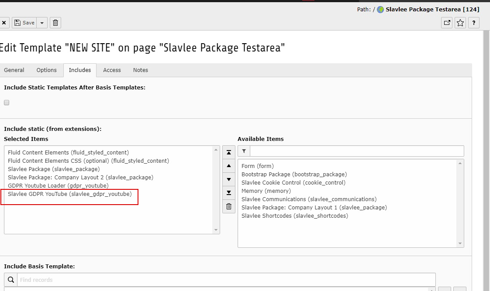

.. _admin-manual:

Administration Manual
=======================

Installation
------------------

To install this plugin upload the zip file with the Extension Manager of TYPO3 and click on upload.
After the installation you have to add the Static TS in your TypoScript template:

   
Save the page and your are done.
