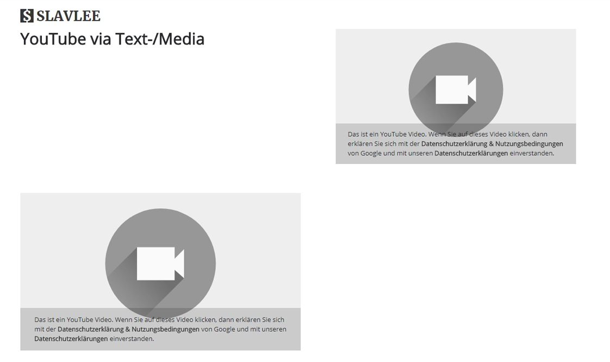

.. _what-it-does:

Introduction
============

   Slavlee GDPR YouTube replaces all occurances of YouTube and Vimeo iFrames that are located on your TYPO3 website.

   The replacement informs the user about the cookie policy of Google, Vimeo and your website. The video will be loaded, when the user clicks on the replacement box.
   No data will be send to Google or Vimeo before that.

Support
-----------

This extension is developed by Slavlee. If you find any bugs or need help, then visit our webpage: https://www.slavlee.de. 