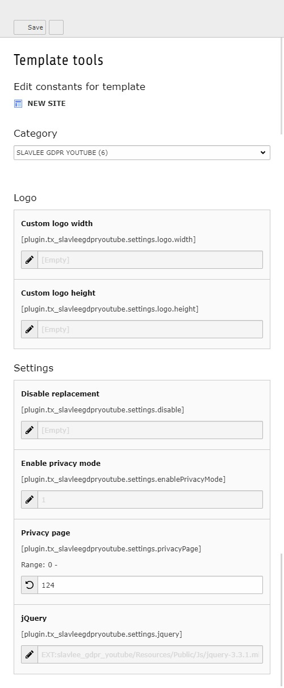

Users Manual
============

Target group: **Editors**

Configuration
-------------

**Constant Editor**

Then you have to set the uid of your privacy page with the constant editor:

   
Inside the constant editor you have more options to set.

**Logo size**

You can set custom size for the play logo.
The width and height is optional, if you choose to enter a size, then this plugin expects you to enter size type (px or %) as well. 
Slavlee GDPR YouTube will set the logo size automatically, if you have set width and height for the iframe.

**Settings**

*Disable replacement*

If you want to temporarily disable the replacement, then enable this option.

*Enable privacy mode*

This option will trigger the automatically replacement of the URL: www.youtube.com to www.youtube-nocookie.com, inside iframes.
This will force YouTube videos to be played in the advanced privacy mode.

*Privacy page*

Set the uid of your privacy page. This is needed for the notice inside the replacement.

*jQuery*

This will include the jQuery file. You can change the file or set it to empy value to disable it, if you already have jQuery on your page.
